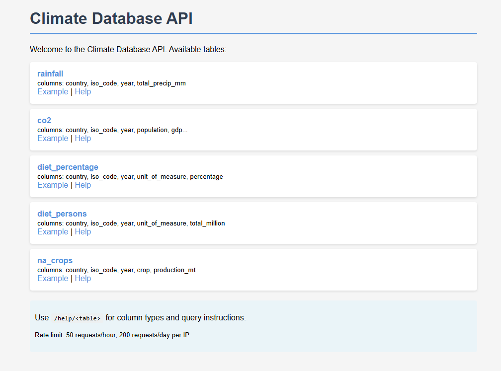
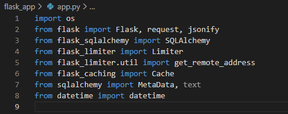
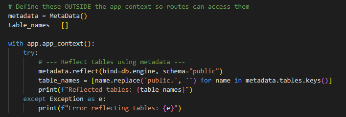
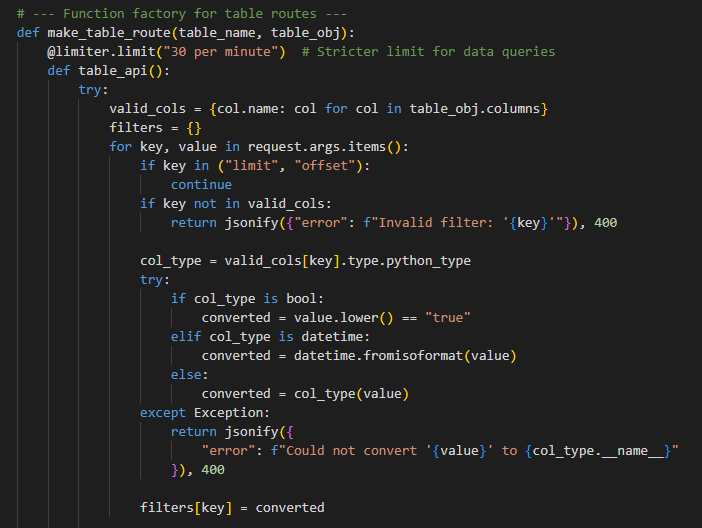
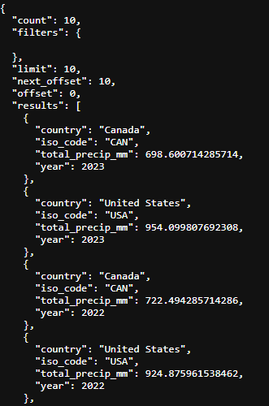
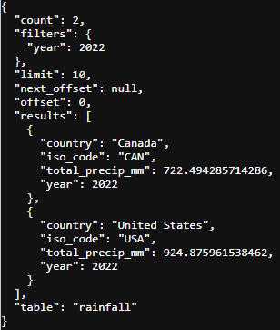
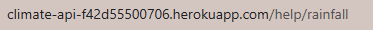
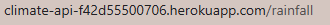
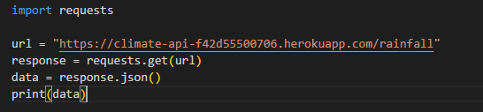

# README for Climate Flask API

## Introduction

This project is a Flask-based API for querying climate data stored in the PostgresSQL database hosted on AWS RDS. It provides endpoints to list tables, filter data, and view metadata programatically. While the root URL `/` returns a simple HTML page for browsing tables, the primary functionality is exposed as a JSON API. That means that people can access data from the database from this API, i.e. store data locally and make advanced queries.
The API is avaible publicly here: [https://climate-api-f42d55500706.herokuapp.com/](https://climate-api-f42d55500706.herokuapp.com/)

## Data

The data for this project comes from several different sources:

First a very large dataset from Our World in Data (OWID: https://ourworldindata.org/) the shows global CO₂ emissions since the year 1750. This contains data from every country in the world, it's a large CSV file that was downloaded directly from the site (full citation in [References](#references)).

The next dataset comes from the Food and Agriculture Organization and World Bank (World Bank: https://data.worldbank.org/). This dataset shows the affordability of a healthy diet globally. It shows how many people are able to afford a healthy diet in each country. This was another CSV file downloaded directly from the site (full citation in [References](#references)).

The next dataset also comes from the World Bank but also the Climate Change Knowledge Portal (CCKP: https://climateknowledgeportal.worldbank.org/). This CSV was obtained through an API request, looking for a timeseries of annual rainfall from 1908-2024. The specific API request in found in the `main_backup.ipynb` or `CCKP_rainfall_data.ipynb` notebooks of this repo. A full citation come be found in [References](#references).

Finally datasets of crop production of Canada and the United States of America were found at Statistics Canada (Stats Can: https://www.statcan.gc.ca/en/start) and the United States Department of Agriculture Quick Stats (USDA Quick Stats: https://www.nass.usda.gov/Quick_Stats/). These two datasets contains information on historical wheat and corn production that was used for this project. A full citation come be found in [References](#references).

This is the same data used in two other projects for this portfolio. The other projects are avaible here:

* [https://github.com/nickbartram/climate_agriculture_impact.git](https://github.com/nickbartram/climate_agriculture_impact.git)
* [https://github.com/nickbartram/tableau_climate.git](https://github.com/nickbartram/tableau_climate.git)

## Methodology

This project was completed using Flask, python and SQLAlchemy on VSCode. The project benefitted from extensive EDA (exploratory data analysis) and ETL (extract, transform, load) that was done initially in the Streamlit app located [here](https://github.com/nickbartram/climate_agriculture_impact.git). A more thorough breakdown of this process is available in the README for that app. Briefly the data was extracted from real world sources, cleaned, and uploaded to an RDS database. That public database is used in this Flask app.

First `app.py` needs to load it's dependencies:

Next the app is instantiated and connected to the PostgreSQL database using SQLAlchemy.  Limits and caching are set to prevent abuse. The public nature of this app requires some security consideration.

The app reflects the database schema using SQLAlchemy's metadata:

HTML and CSS are used to make the homepage look a little more presentable. Routes are created, some with the benefit of a function factory (the snippet below shows the beginning of the function factory):

The function factory is used to avoid Python's late binding behavior in loops. Otherwise all routes would reference only the last table. This ensures the API endpoint correctly queries its intended table.

The Heroku CLI was downloaded locally, and used to push changes to that site. It's free for this small project and allows it to be viewed publicly. This was done using the Heroku site, and through Git Bash. It only took signing up for an account, logging in to the account, and creating a Heroku app within the same directory as the Flask app. It functions similarly to Git Hub in this sense, with pushes be very similar.

The entire app is avaible to view in this reposistory, listed as `app.py`.

## Results

The Flask API provides programmatic access to the PostgreSQL database. It allows users to query and retrieve data as JSON, which can then be stored or processed locally. For more advanced queries, users can download the data and analyze it on their own machine.

Basic API queries produce a JSON response:

[https://climate-api-f42d55500706.herokuapp.com/rainfall](https://climate-api-f42d55500706.herokuapp.com/rainfall)

[https://climate-api-f42d55500706.herokuapp.com/rainfall?year=2022
](https://climate-api-f42d55500706.herokuapp.com/rainfall?year=2022)

## Security

The data uses inbound rules for accessibility, which means any client on the internet can connect. This Flask app uses public data, so that is not a concern. However, this would not be secure for sensitive production data. Cost protection is done with rate limiting, query timeouts, and AWS billing alerts. A production application would use more secure methods, like a VPC, security groups, and secret management.

## Conclusion

This Flask API provides a useful method of accessing the PostgreSQL database. Public access with Heroku allows anyone on the internet to interact with this database. The API homepage allows users to view the data, and the API itself is able to be called programmatically.

This was the final project completed in this portfolio. I realized that the Flask API could have been reused as a central backend for the other projects, particularly the Streamlit app, allowing them to query data programmatically without connecting directly to the database. A similar approach could have been used for the Tableau presentation, but the cost of a Tableau subscription was prohibitive for this project.

## References

- Our World in Data. *CO₂ Data.* Available at: [https://github.com/owid/co2-data](https://github.com/owid/co2-data)
- World Bank & FAO. *Cost and Affordability of a Healthy Diet (CoAHD).* Available at: [https://data360.worldbank.org/en/dataset/FAO_CAHD](https://data360.worldbank.org/en/dataset/FAO_CAHD)
- World Bank. *Climate Change Knowledge Portal.* Available at: [https://climateknowledgeportal.worldbank.org/download-data](https://climateknowledgeportal.worldbank.org/download-data)
- Statistics Canada. Available at: [https://www150.statcan.gc.ca/t1/tbl1/en/cv.action?pid=3210035901](https://www150.statcan.gc.ca/t1/tbl1/en/cv.action?pid=3210035901)
- USDA. *Quick Stats.* Available at: [https://quickstats.nass.usda.gov/](https://quickstats.nass.usda.gov/)

## Usage

##### Accessing Data Using the Website

The Flask API provides a simple homepage at `/` where you can explore available tables and their columns.

* Click on a table to see example queries and a sample of the data
* Each table page alose includes a **Help** link (e.g., `help/<table_name>`) showing the column types, usage
* You can filter and limit results directly in the URL. For example:

  

  

##### Accessing Data Programmatically

The API can also be queried programmatically from scripts, notebooks, or other applications.

* All endpoints return data in JSON format, making it easy to process in Python or other programming languages
* Example Python usage, querying entire `rainfall` table with `requests`:

  
* Combine filters, limits, and offsets to retrieve exactly the data you need

Note: Numeric columns require exact values for filtering. For broader analyses, consider fetching a range of data and filtering locally.
